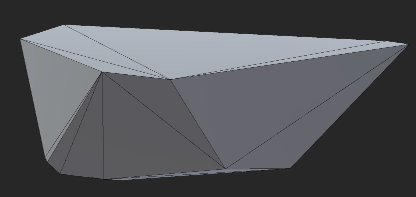

## 实时破碎模拟

为学习基础破碎算法和Unity Mesh编程，不使用任何第三方库，从零开始写代码。

改进后的方法：外侧种子点合并为一个复合刚体

**小范围破碎**

**大范围破碎**

### 解算流程

### 代码UML图

TriangleDiagram是一个为本项目特别设计的Mesh管理类，可储存和维护模型的顶点、三角形面片、四面体组件信息。目前仅支持有棱刚体（即不存在曲面）的破碎。

在本机环境下进行目标帧率为60帧的帧率测试，结果如下：

| 实现方法              | 最低帧率/FPS |
| ----------------- | -------- |
| .Net内置哈希表+修改式分割   | 0.52     |
| 自定义哈希表+修改式分割      | 25.47    |
| 自定义哈希表+生成式分割      | 35.42    |
| 自定义哈希表+生成式分割+顶点合并 | 56.24    |

注：

修改式分割：直接修改原Mesh的顶点和面片信息；

生成式分割：生成新的Meshes；

顶点合并：合并重合或共线的顶点，以降低迭代复杂度，如下图所示：

| 无顶点合并                                        | 有顶点合并                                 |
| -------------------------------------------- | ------------------------------------- |
|  |  |

